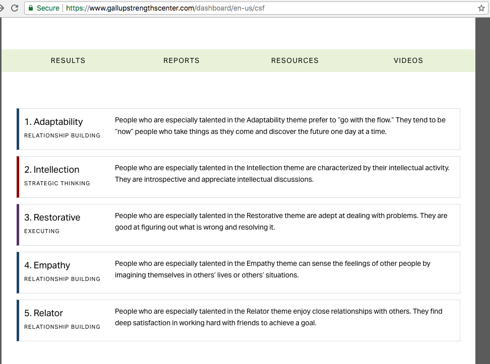
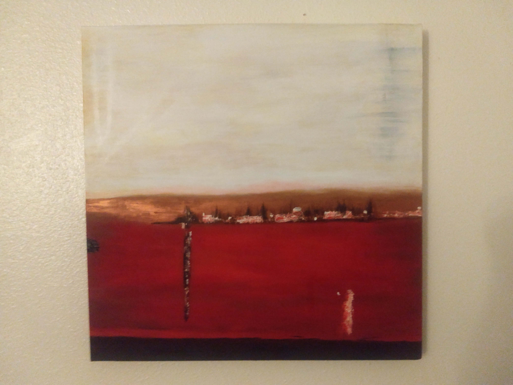
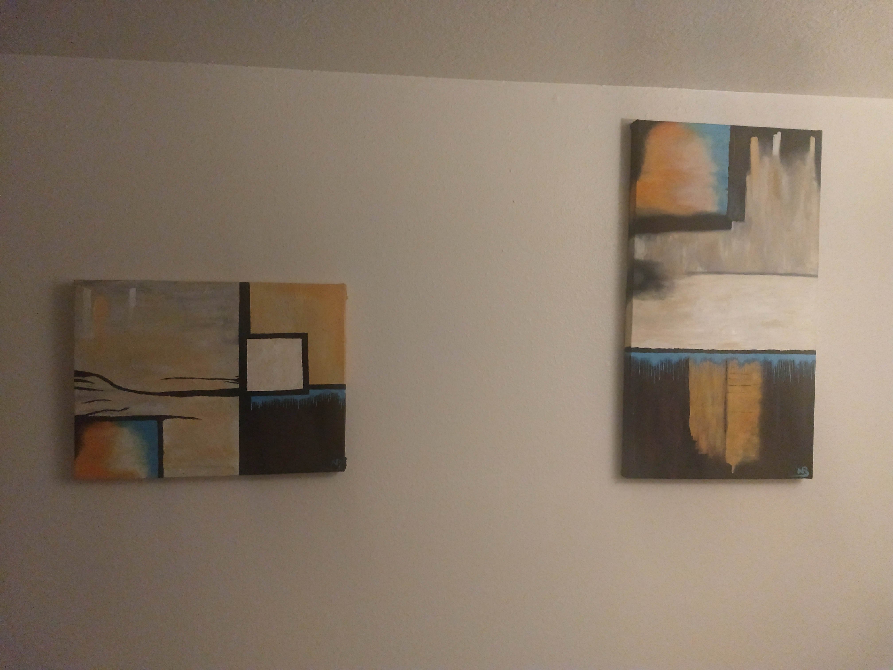

# Self Authentication

###### Epicodus: Ruby Independent Project 08/14/2018
###### By Nicholas Brown

## Description
A project for my personal branding. Its goal is to find ways to express part of my life. Hopefully, this expression exercise will transfer over and help me with my resume, cover letters and portfolio. I start out in this readme, with a self-reflection of my strengths and skills. Then, I will explain how those stenghths, skills, and hobbies tansfer into my project and its design/inspiration. 


## The "big picture"

I always start any personal project the same way, with a book. I tend to find myself running down a rabbit hole where I realize that the contraption I proudly built, which rotates around its center axis and reduces friction, is a wheel. So, with a quick online search I found a book, Strengths Finder 2.0 by Tom Rath, to help me with its overall suggestion of the top five themes/strengths that are associated wit my personality. The book was advertised well, with high star average amazon rating. I didn't read close enough to see that the ebook I was buying was just a collection of 34 strengths/theme's explinations and suggestions, and that I can only take the test, online, ONCE (I wanted to share the test with my classmates). Not sraping the strengthFiner idea for the self assignment project and starting over I'm going to see what the results have to offer me (I'm going frustratingly ignore all the various "spend more money and upgrade for additional results" options listed all over the website). 



#### Adaptability

* Fine-tune my responsiveness, when uncreditable work pressure hits practice the first 3 moves I will make. 
        - One of the most useful responses that I have found helpful over the years is to not say "you" whenever anyone does something that bothers me. Saying 'you' tends to be fighting words by someone on the defense. There is a big difference between saying "You need clean those dirty dishes. They have been left out for days now", than "I get really frustrated and upset when I see dirty dishes that look to be rotting" I found that if I start by declaring "you" my roommate responds himself by also saying "yeah... but you did this" and we got nowhere until I thought about how I respond to uncreditable roommate conflict.

#### Intellection

* Write down ideas in a log. They might provide valuable insights.
        - I love painting, and recently I have been into abstract art. I get that 'I can do that, but better' feeling looking at different abstract paintings. 
        
        
        

#### Restorative
* Constant improvement is one of your hallmarks seek opportunity to enhance my ablilities through a demanding field, activity, or endevavor that requires exceptional skill and/or knowledge. 
        - The brain is a muscle, and I think that it is important to contiuously keep working it out. [Whenever I have the free time to study I pick up chess and try to improve my chess skilss.](http://www.uschess.org/datapage/ratings_graph.php?memid=12902073)

#### Empathy
* Create a ritual at the end of the day to signal that work is over. This will help me emotions and prevent burnout. 
        - At the end of a work day, I need to get outside. Get some fresh air and relax/walk around. If I am going to not be able to leave my work at work. If I don't, I find it hard to talk to my friends, family, even random strangers. My mind is constantly reiterating over all the problems that I have been stuck on and will continue to be stuck in that loop if I don't break out of it. 


#### Relator
* Let it be known I am more interested in the character and personality of others than their status or job title. 
         - I simple will not golf with some people I've met, and they are way better golfers than I am. Someone cannot hide an anger problem on a golf course. People are going to hit frustratingly bad shots when they know they are more than capable of hitting a decent one. It ruins my round of golf. Its like... "dude, you are playing on a weekend with bogey golfers. Why are you getting so mad when you are drastically outplaying everyone here? We came out today to have fun..." 


## Project Design

I never watched sports as a kid. I wasn't interested. I could never watch more than a few minutes of the super bowl. The only reason I started playing fantasy sports was to play with my friends in their league. I didn't want to miss out. I found fantasy sports to be like the stock market with lot of uncertainty, but not completely unpreidcable(adaptability -> I did well just trying to mimic everyone else in the leage). The right analysis it can help a person beat the stock market can also be used to beat my friends (Restorative -> redirect my focus from thinking about work to a game). This project's goal is to serve as website for a fantasy league. Something that I look forward to doing at the end of the day. (empathy -> it is the primary way I communicate with alot of my friends) One objective of the website to have posts. So that I can help one of my friends in the league wants to write a weekly write up. I am interested in communicating and having fun in addition to winning (relator -> noone would share any sports knowledge to their competitors if they were only focused on their team's success.). Another objective is to have some pages/routes for the fantasy league's data analysis. I want to practice and increase my mathematical/analysis skills (intellection strength -> learning for the goal of learning itself). 

## Specifications
* _1 sign in as a user
  - _Example Input: _  email + password + password
  - _Example Output: _ "You have successfully signed up"
* _1 user adding posts
  - _Example Input: _  "Looking into Josh Gordon's future in the NFL..."
  - _Example Output: _ write up post
* _1 user upvote/downvote
  - _Example Input: _  upvote
  - _Example Output: _ upvotes 1 downvotes 0


## Setup/Contribution Requirements

1. Clone the repo
```
git clone <website>
```
1. bundle Gems
```
$bundle install
```
1. database
```
rails db:create
rails db:migrate
```
1. host app locally
```
$rails s
```
1. insert localhost with <port number> given in terminal into a webpage's URL
```
localhost:<port number>      ---example--- localhost:3000
```

## Technologies Used

* Ruby 2.5.1

### License

*{This software is licensed under the MIT license}*

Copyright (c) 2018 **_  Nick Brown  _**
